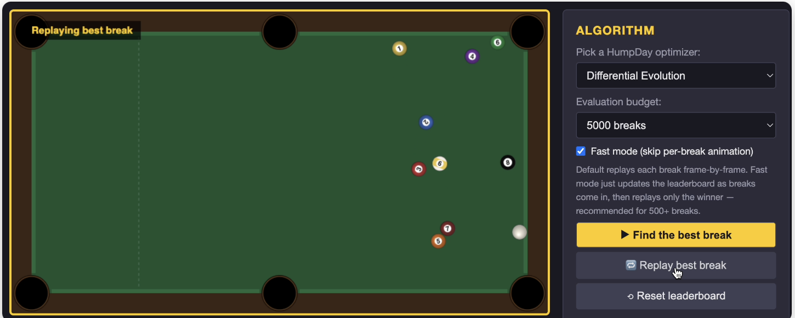

# Humpday: Pure Python or Javascript Derivative-Free Optimization

[](https://github.com/microprediction/humpday/actions)
[](https://opensource.org/licenses/MIT)
[](https://www.python.org/downloads/)

**[Documentation & Live Demos](https://humpday.microprediction.org)**

22 derivative-free optimization algorithms in pure Python. No compilation, no required dependencies.

## See it work

[](https://humpday.microprediction.org/applications/pool.html)

Differential Evolution clears a 9-ball rack on a single break — one of
[13+ interactive applications](https://humpday.microprediction.org/applications/index.html)
that pit every HumpDay optimizer against a real physics or engineering problem.
([Watch the 14-second video](https://github.com/microprediction/humpday/raw/main/docs/assets/video/the-perfect-break.mp4)
· [**Browse all applications →**](https://humpday.microprediction.org/applications/index.html))

## Optimizing on the simplex

Mixtures, portfolios, and allocations live on the **probability simplex** (weights
that sum to 1), not the cube. HumpDay optimizes them by lifting a plain `[0,1]ⁿ`
objective through a smooth bijection **φθ** onto the simplex — so every box-domain
optimizer works unchanged.

[](https://humpday.microprediction.org/simplex-cube-bijection.html)

The map's scale is a tunable *preconditioner*: too small
and the whole cube collapses onto the centroid; tuned (the `θ★` shown), off-centre
optima map back to interior cube points where optimizers sample densely.
[**Explore it live →**](https://humpday.microprediction.org/simplex-cube-bijection.html)
(drag to orbit, morph cube ⇆ simplex, watch the optimum's pre-image move).

For fun, the same map applied to a football pitch — straight lines bend, the
centre circle becomes an oval, the corners smear toward the boundary:
[**⚽ the beautiful game on the simplex →**](https://humpday.microprediction.org/soccer-field-simplex.html).

## Install & Use

```bash
pip install humpday
```

Zero runtime dependencies. Every algorithm has a pure-Python implementation
that works wherever Python runs.

If you want the numpy-accelerated backend for higher dimensions:

```bash
pip install humpday[fast]
```

The same algorithm code runs either way; humpday transparently uses numpy
when it's available and falls back to pure Python when it isn't.

```python
from humpday import minimize

def objective(x):
    return (x[0] - 2)**2 + (x[1] - 3)**2

result = minimize(objective, bounds=[(-5, 5), (-5, 5)], method='DifferentialEvolution')
print(f"Solution: {result.x}")  # [2.0, 3.0]
```

## Algorithms

22 validated optimizers: **[See them in action](https://humpday.microprediction.org)** | **[Source code](humpday/optimizers/alloptimizers.py)**

Trust region methods, evolutionary algorithms, metaheuristics.

## Save the Planet

Cut and paste to avoid waste.

```
Read https://raw.githubusercontent.com/microprediction/humpday/main/SKILL.md
and create a project skill from it.
```

[`SKILL.md`](SKILL.md).

## Comparison

Marginal install footprint on top of a Python environment that already has numpy:

| Library | Adds on top of numpy | Global optimizers |
|---------|---------------------:|------------------:|
| **Humpday** | **~1 MB** (or zero without `[fast]`) | **22** |
| SciPy       | ~100 MB | 6 documented |
| Optuna      | ~30 MB  | 11 samplers |
| Nevergrad   | ~230 MB | 540+ registered (tuned variants of ~30 base methods) |

**Humpday's niche**: when you need optimization that works anywhere Python runs, without dependencies or compilation.

## License

MIT - Use freely in commercial and research projects.
